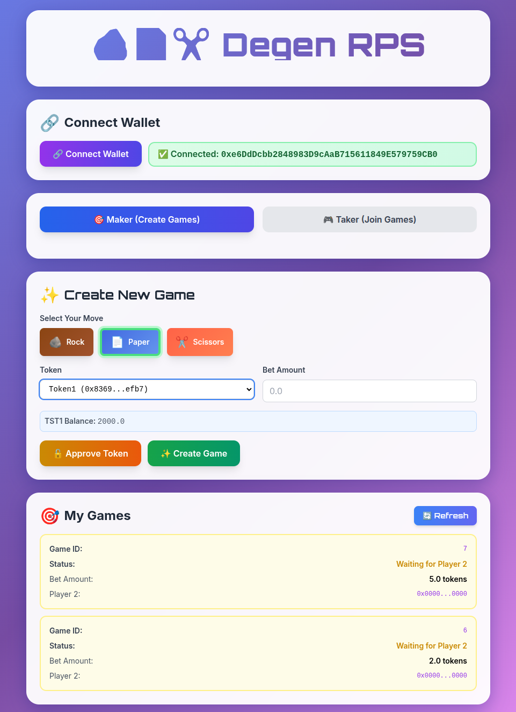

# ZK Rock Paper Scissors Game | Degen Edition

[](https://www.gnu.org/licenses/gpl-3.0)

 


A zero-knowledge implementation of the classic rock-paper-scissors game where Player 1 commits their move, Player 2 joins with their move directly, and Player 1 reveals with ZK proofs to resolve the game on-chain. 

## Overview

The project includes two game modes:

- **Basic RPS** (`/`): A simple rock-paper-scissors game where players commit and reveal moves using ZK proofs. No token betting required.
- **Degen RPS** (`/swap-rps`): A token-betting version where players stake tokens on each game. The winner takes the escrowed tokens.



### Game Flow

- **Player 1** creates a game by committing their move (`keccak256(move || salt)`) and optionally escrowing tokens (in degen mode).
- **Player 2** joins any open game by submitting their move directly (no commitment needed) and matching the stake (in degen mode).
- Once matched, **Player 1** reveals their move plus salt along with a Noir-generated ZK proof that the outcome was computed correctly.
- The contract validates the commitment, verifies the ZK proof, and pays the escrowed tokens to the winner (or slashes Player 1 if they fail to reveal before expiry).

### Frontend Pages

1. **`/` (Basic RPS)**: Simple rock-paper-scissors game interface
2. **`/swap-rps` (Degen RPS)**: Token-betting version
3. **`/fund`**: Token faucet for testnet tokens

### ZK Proof Generation Flow

1. **Player 2 joins** and submits their move directly to the contract
2. **Player 1 reveals their move** (move + salt) after Player 2 has joined
3. **Frontend computes expected winner** using the same logic as the contract
4. **Noir circuit executes** with both moves and winner as inputs
5. **Barretenberg backend generates a proof** proving the computation is correct
6. **Proof is verified locally** before sending to contract
7. **Proof is sent to contract** via `resolveGame()` (on-chain verification pending)

## Game Flow

```
Player 1                     Contract                    Player 2
   |                            |                            |
   |-- createGame(commitment) ->|                            |
   |                            |                            |
   |                            |<-- joinGame(move) ------|
   |                            |    (move stored on-chain) |
   |                            |                            |
   |-- resolveGame(move+salt) ->|                            |
   |     + ZK proof             |                            |
   |                            |-- _resolveGame() ----------|
   |<-- GameResolved event -----|                            |
```

## Setup

### Prerequisites

- **Node.js** 18+ and npm
- **Noir** ([install instructions](https://noir-lang.org/docs/getting_started/nargo_installation))
- **MetaMask** (for wallet connection)

### 1. Install Dependencies

```bash
# Circuit dependencies (Noir comes with nargo)
cd circuit
nargo --version  # Verify installation

# Contract dependencies
cd ../contracts
npm install

# Frontend dependencies
cd ../frontend
npm install
```

### 2. Compile Circuit

```bash
cd circuit
nargo compile
nargo test  # Verify all tests pass
```

This generates `target/circuit.json` needed by the frontend.

### 3. Setup Frontend Artifacts

```bash
cd frontend

# Copy compiled circuit
mkdir -p target
cp ../circuit/target/circuit.json target/

# Copy contract artifact (after compilation)
cp ../contracts/artifacts/contracts/RockPaperScissors.sol/RockPaperScissors.json contract-artifact.json
```

### 4. Start Local Blockchain (Optional)

If you want to test locally, start a Hardhat node:

```bash
cd contracts
npx hardhat node
```

This will start a local blockchain on `http://127.0.0.1:8545` with test accounts.

### 5. Deploy Contracts (Optional)

If running locally, deploy the contracts to your local network:

```bash
cd contracts
npx hardhat ignition deploy ignition/modules/RockPaperScissors.ts --network localhost
```

For the degen version:

```bash
cd degen-rps
forge script script/Deploy.s.sol --rpc-url http://127.0.0.1:8545 --broadcast
```

Update `frontend/deployments.json` with the deployed contract addresses.

### 6. Run Frontend

Start the development server:

```bash
cd frontend
npm run dev
```

## Future Work

The `raffle-pool/` directory contains work-in-progress code for integrating the RPS game with a Uniswap pool. The original concept was to create a system where:

- **95% of swap funds** would execute a normal Uniswap swap
- **5% of swap funds** would be escrowed into an RPS game
- The winner of the RPS game would take the combined 5% contributions from both players

This integration is currently in development and left for future exploration. The current implementation focuses on standalone RPS games with token betting (as seen in `/swap-rps`).
